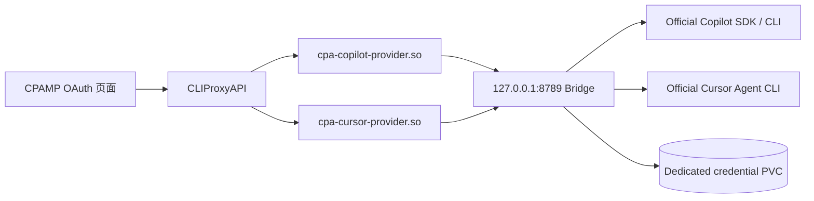

# CPA Copilot Cursor

为 [CLIProxyAPI (CPA)](https://github.com/router-for-me/CLIProxyAPI) 提供原生的 GitHub Copilot 与 Cursor 订阅接入。

一个仓库和一个容器镜像中包含两份 CPA 原生插件：

- `cpa-copilot-provider.so`：在 CPAMP「OAuth 登录」中贡献 **GitHub Copilot Subscription**。
- `cpa-cursor-provider.so`：在 CPAMP「OAuth 登录」中贡献 **Cursor Subscription**。
- 本机桥接进程：使用官方 GitHub Copilot SDK、官方 Copilot CLI 和官方 Cursor Agent CLI 完成登录、模型发现与请求执行。

## 用户体验

1. 在 CPAMP 的「OAuth 登录」页面直接点击 Copilot 或 Cursor 登录。
2. Copilot 按 GitHub 官方 Device Flow 显示一次性设备码；复制设备码并在 GitHub 验证页完成登录。Cursor 直接打开官方登录页。
3. 登录成功后，CPA 只保存一个不透明账号句柄；实际 OAuth 状态保存在桥接服务的独立持久卷。
4. 在 CPAMP 插件菜单中打开对应的 Quota 页面查看账号状态和额度摘要。

Copilot 额度来自官方 SDK 的 `account.getQuota`。Cursor 目前没有公开、稳定的官方订阅额度 SDK；本项目只展示官方 `cursor-agent status` 的结果，不调用逆向工程接口。

GitHub 官方 Device Flow 要求客户端同时展示 `verification_uri` 和 `user_code`。为兼容只向 WebUI 返回 `url/state` 的 CPA 版本，Copilot 插件会返回同域的临时设备授权页；原版 CPAMP 可继续提供“复制链接”和“打开链接”，设备授权页负责展示设备码、复制设备码、复制验证链接和打开 GitHub。设备码默认 15 分钟过期，不会写入日志或认证文件，也不需要修改或 fork CPAMP。

远程部署应在 CPA 主进程中设置 `CPA_COPILOT_CURSOR_PUBLIC_BASE_URL`（例如 `https://cpa.example.com`），让原版 CPAMP 复制出可直接粘贴到新标签页的完整设备授权链接。未设置时插件返回同源相对路径。

Copilot CLI 在无系统 keychain 的无头 Linux 中会询问是否改存 `~/.copilot/config.json`。桥接服务仅在用户主动发起 Copilot 登录后自动确认该提示；凭证保存在账号隔离、权限为 `0700` 的持久卷目录中，不会进入 CPA auth JSON。

部署时应先运行 `cpa-copilot-cursor --prepare-copilot-cache /data/runtime-cache/copilot`。所有 Copilot 账号共用这一份无凭证 runtime cache，各账号的 `COPILOT_HOME` 仍保持隔离，避免每次登录重复展开约 183MB runtime 并触发 WebUI 超时。

## 架构



桥接服务只监听 Pod 内的 `127.0.0.1`，不需要 Service 或 Ingress。建议同时设置 `CPA_COPILOT_CURSOR_SECRET`，让 CPA 主容器和 bridge sidecar 使用同一个 Kubernetes Secret。

## 项目范围

本仓库只支持 GitHub Copilot 与 Cursor，不接受把第三个 AI 提供商直接加入本镜像。新增提供商应使用独立仓库、独立 CPA 插件和独立镜像，避免每增加一套官方 CLI 就让所有用户承担额外镜像体积。可复用的纯 Go 协议或测试代码可以另行提取为共享库。

## 镜像内容

发布镜像：

```text
ghcr.io/linonetwo/cpa-copilot-cursor:<version>
```

Harbor Proxy Cache 可按标准 `ghcr.io` 上游缓存该镜像，无需为 CPA 整个项目设置 HTTP 代理。

镜像内路径：

```text
/plugins/cpa-copilot-provider.so
/plugins/cpa-cursor-provider.so
/usr/local/bin/cpa-copilot-cursor
/opt/copilot/copilot
/opt/cursor-agent/node
/opt/cursor-agent/index.js
```

Distroless 镜像不包含 Shell。init container 应执行
`/usr/local/bin/cpa-copilot-cursor --install-plugins <目标目录>` 安装两份 CPA 插件。

## CPA 配置

```yaml
plugins:
  enabled: true
  dir: /root/.cli-proxy-api/plugins
  configs:
    cpa-copilot-provider:
      enabled: true
    cpa-cursor-provider:
      enabled: true
```

Pod 中需要：

- init container 把 `/plugins/*.so` 复制到 CPA 的插件目录。
- bridge sidecar 运行镜像默认命令。
- bridge sidecar 挂载独立 `/data` PVC。
- CPA 主容器与 bridge sidecar 设置相同的 `CPA_COPILOT_CURSOR_SECRET`。

## 本地验证

```bash
go test ./...
docker build -t cpa-copilot-cursor:dev .
```

Docker 构建固定校验官方 Copilot CLI 下载包的 SHA-512 和 Cursor Agent 下载包的 SHA-256；Go bridge 固定使用 `github.com/github/copilot-sdk/go v1.0.8`。
最终运行阶段使用固定摘要的 Chainguard `glibc-dynamic` 无 Shell 镜像；Cursor 直接通过其内置 Node 启动，不依赖 Bash。

## 安全原则

- 不把 Copilot/Cursor OAuth 令牌写入 CPA auth JSON。
- 不提供硬件 ID 重置、反封禁或绕过订阅限制功能。
- 不暴露 bridge 端口到 Pod 外部。
- Quota 页面不渲染令牌或原始凭据。
- Cursor 不调用未公开的逆向额度 API。

详细威胁模型见 [SECURITY.md](SECURITY.md)。

## License

MIT
