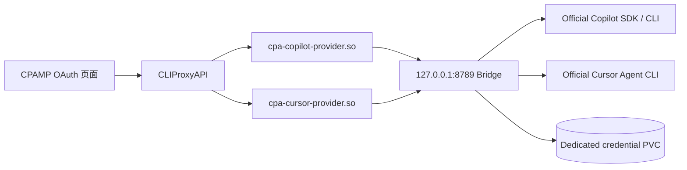

# CPA Subscription Bridge

为 [CLIProxyAPI (CPA)](https://github.com/router-for-me/CLIProxyAPI) 提供原生的 GitHub Copilot 与 Cursor 订阅接入。

一个仓库和一个容器镜像中包含两份 CPA 原生插件：

- `cpa-copilot-provider.so`：在 CPAMP「OAuth 登录」中贡献 **GitHub Copilot Subscription**。
- `cpa-cursor-provider.so`：在 CPAMP「OAuth 登录」中贡献 **Cursor Subscription**。
- 本机桥接进程：使用官方 GitHub Copilot SDK、官方 Copilot CLI 和官方 Cursor Agent CLI 完成登录、模型发现与请求执行。

## 用户体验

1. 在 CPAMP 的「OAuth 登录」页面直接点击 Copilot 或 Cursor 登录。
2. Copilot 按 GitHub 官方 Device Flow 显示一次性设备码；复制设备码并在 GitHub 验证页完成登录。Cursor 直接打开官方登录页。
3. 登录成功后，CPA 只保存一个不透明账号句柄；实际 OAuth 状态保存在桥接服务的独立持久卷。
4. 在 CPAMP 插件菜单中打开对应的 Quota 页面查看账号状态和额度摘要。

Copilot 额度来自官方 SDK 的 `account.getQuota`。Cursor 目前没有公开、稳定的官方订阅额度 SDK；本项目只展示官方 `cursor-agent status` 的结果，不调用逆向工程接口。

GitHub 官方 Device Flow 要求客户端同时展示 `verification_uri` 和 `user_code`。为兼容只向 WebUI 返回 `url/state` 的 CPA 版本，桥接服务会把设备码同时放入 URL 的 `user_code` 查询参数和插件 metadata；支持设备码 UI 的 CPAMP 可将它独立展示并提供复制按钮。设备码默认 15 分钟过期，不会写入日志或认证文件。

## 架构



桥接服务只监听 Pod 内的 `127.0.0.1`，不需要 Service 或 Ingress。建议同时设置 `CPA_SUBSCRIPTION_BRIDGE_SECRET`，让 CPA 主容器和 bridge sidecar 使用同一个 Kubernetes Secret。

## 镜像内容

发布镜像：

```text
ghcr.io/linonetwo/cpa-subscription-bridge:<version>
```

Harbor Proxy Cache 可按标准 `ghcr.io` 上游缓存该镜像，无需为 CPA 整个项目设置 HTTP 代理。

镜像内路径：

```text
/plugins/cpa-copilot-provider.so
/plugins/cpa-cursor-provider.so
/app/app.py
/opt/cursor-agent/cursor-agent
```

## CPA 配置

```yaml
plugins:
  enabled: true
  dir: /root/.cli-proxy-api/plugins
  configs:
    cpa-copilot-provider:
      enabled: true
    cpa-cursor-provider:
      enabled: true
```

Pod 中需要：

- init container 把 `/plugins/*.so` 复制到 CPA 的插件目录。
- bridge sidecar 运行镜像默认命令。
- bridge sidecar 挂载独立 `/data` PVC。
- CPA 主容器与 bridge sidecar 设置相同的 `CPA_SUBSCRIPTION_BRIDGE_SECRET`。

## 本地验证

```bash
go test ./...
PYTHONPATH=bridge python -m unittest discover -s bridge/tests -v
docker build -t cpa-subscription-bridge:dev .
```

Docker 构建固定校验 Cursor Agent 下载包的 SHA-256，并固定 `github-copilot-sdk==1.0.8`。

## 安全原则

- 不把 Copilot/Cursor OAuth 令牌写入 CPA auth JSON。
- 不提供硬件 ID 重置、反封禁或绕过订阅限制功能。
- 不暴露 bridge 端口到 Pod 外部。
- Quota 页面不渲染令牌或原始凭据。
- Cursor 不调用未公开的逆向额度 API。

详细威胁模型见 [SECURITY.md](SECURITY.md)。

## License

MIT
